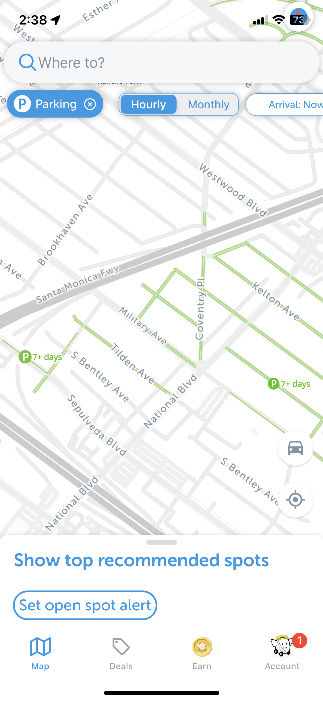
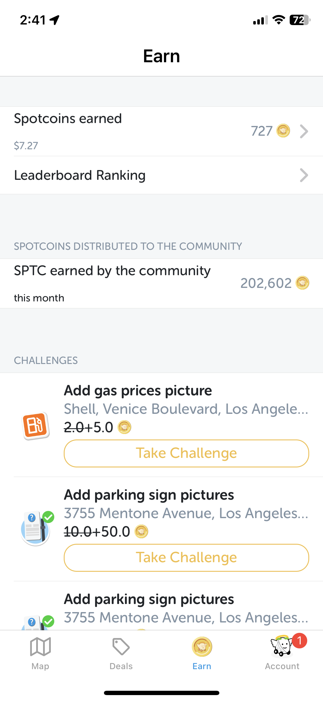

# Heuristic Evaluation – SpotAngeles 
## Yun-Pu Yang 

### Background
For this project, I would like to conduct heuristic evaluation for an app, [SpotAngels](https://www.spotangels.com/), which designs for users to find parking spots on streets. 

Below are screenshots of SpotAngels––

      

According to the official website of the app, SpotAngeles can help users "find free parking, get reminders before street cleaning or any other rule, and get deals in garages." This app is a community-based app. Users can upload images of the parking signs and provide updatest parking rules in the app. 

### Heuristic Evaluation

### Overall Review
Tentative title (of interest) of your project
2) Your name and course info
3) Description about the project how you want to contribute with your UX design
~~TWO apps for analysis. Per each web/app of your choice, please include:~~
~~4) Information about the app of your choice
a) Provide the screenshot(s) of the web/app
b) Provide the URL (provide a link to the landing website of the app)
c) Provide brief information about the web/app~~
d) Provide your overall evaluation of that web/app
5) Heuristic evaluation (either by web_contents or by a downloadable document)
a) Provide all 10 heuristics listed
i) You need to review the websites with all 10 heuristics one by one, please
explain the heuristic in your own terms.

b) Provide the detailed analysis of the web/app with the comments
i) The web/app may have no issue on that related heuristic you inspect -
then, explain why you think the website is okay for your evaluation.
ii) If the website violates the related heuristic, you will explain why and
suggest the source of that issue and possible solution.

c) Provide severity ratings
